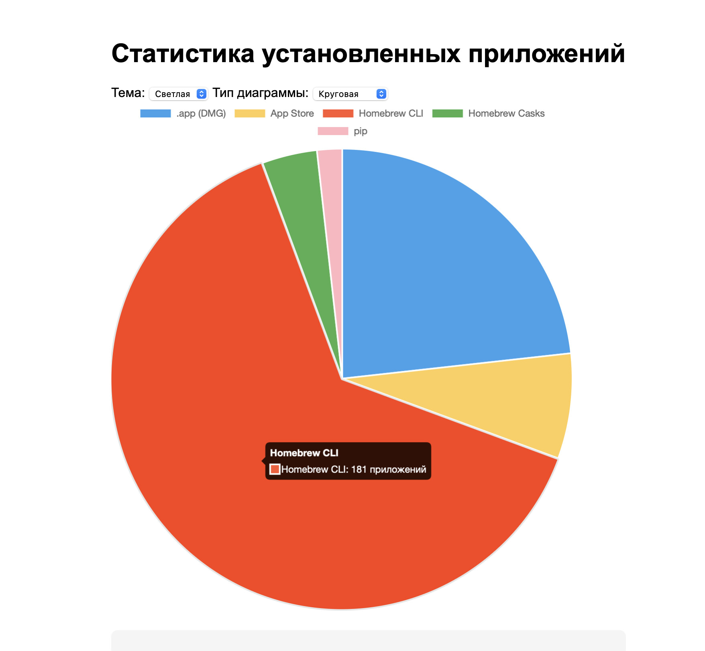

# 📊 Скрипт для анализа и визуализации установленных приложений на MacBook

Этот Bash-скрипт (`backup_user_apps.sh`) предназначен для анализа установленных приложений на MacBook. Он классифицирует приложения по источникам установки, генерирует отчеты в формате Markdown и JSON, а также создает интерактивную HTML-страницу с круговой или столбчатой диаграммой для визуализации данных.

---

## 📋 Обзор скрипта

### Что делает скрипт?

Скрипт выполняет следующие задачи:

1. **Сбор данных об установленных приложениях**:
   - Приложения из `.app` (DMG или ручная установка).
   - Приложения из **App Store** (с помощью утилиты `mas`).
   - CLI-пакеты, установленные через **Homebrew** (`brew list --formula`).
   - GUI-приложения, установленные через **Homebrew Casks** (`brew list --cask`).
   - Пакеты Python, установленные через **pip** (`pip3 list`).
2. **Генерация отчетов**:
   - Создает Markdown-файлы для каждой категории приложений в папке `OUTPUT/reports`.
   - Создает JSON-файл с полной информацией об установленных приложениях в папке `OUTPUT/data`.
3. **Визуализация**:
   - Генерирует HTML-страницу (`apps_chart.html`) с интерактивной диаграммой, построенной с использованием библиотеки Chart.js.
   - Поддерживает переключение между светлой и темной темой, а также между круговой и столбчатой диаграммой.
   - При клике на сектор диаграммы отображается список приложений в выбранной категории.

### Для чего это нужно?

- **Анализ установленных приложений**: Позволяет быстро понять, сколько приложений установлено и откуда они были установлены.
- **Визуализация данных**: Интерактивная диаграмма упрощает восприятие информации.
- **Документирование**: Markdown- и JSON-отчеты полезны для архивирования или передачи данных.

---

## 🛠️ Как работает скрипт?

### Зависимости

Скрипт использует следующие утилиты:

- `brew` (Homebrew) — для работы с CLI- и GUI-пакетами.
- `pip3` — для анализа Python-пакетов.
- `mas` — для получения списка приложений из App Store.
- `jq` — для генерации JSON-отчета.
- `awk`, `grep`, `sed` и другие стандартные утилиты Unix.

Функция `check_dependencies` проверяет наличие этих утилит и, если они отсутствуют, предлагает установить их с помощью `brew`. Например:

```
⚠️ Утилита 'mas' не найдена. Установи через: brew install mas
```

### Структура скрипта

Скрипт состоит из нескольких ключевых функций:

1. **Сбор данных**:
   - `filter_dmg_apps`: Извлекает приложения из директорий `/Applications` и `~/Applications`, исключая системные записи (например, "Helper", "Updater").
   - `write_dmg`, `write_appstore`, `write_brew`, `write_cask`, `write_pip`: Генерируют Markdown-файлы для каждой категории.
2. **Визуализация**:
   - `write_visual_chart`: Создает HTML-файл с интерактивной диаграммой.
3. **Управление процессом**:
   - `write_header`: Добавляет заголовок и дату в Markdown-файлы.
   - `write_all`: Выполняет полный цикл — сбор данных, генерацию отчетов и визуализацию.
   - `spinner`: Отображает анимацию загрузки во время выполнения операций.

### Аргументы командной строки

Скрипт принимает следующие аргументы:

- `--dmg`: Генерирует отчет только для приложений из `.app` (DMG).
- `--appstore`: Генерирует отчет только для приложений из App Store.
- `--brew`: Генерирует отчет только для CLI-пакетов Homebrew.
- `--cask`: Генерирует отчет только для GUI-приложений Homebrew (Casks).
- `--pip`: Генерирует отчет только для пакетов, установленных через pip.
- `--all`: Выполняет полный анализ и создает все отчеты, включая визуализацию.

Если аргумент не указан, скрипт выведет инструкцию:

```
❗ Использование: ./backup_user_apps.sh [--dmg | --appstore | --brew | --cask | --pip | --all]
```

### Выходные данные

Скрипт создает следующую структуру файлов:

```
OUTPUT/
├── data/
│   └── installed_apps-YYYY-MM-DD.json  # JSON-отчет с приложениями
└── reports/
    ├── dmg.md         # Приложения из .app (DMG)
    ├── appstore.md    # Приложения из App Store
    ├── brew.md        # CLI-пакеты Homebrew
    ├── cask.md        # GUI-приложения Homebrew
    ├── pip.md         # Пакеты pip
    ├── apps_chart.html # HTML-файл с диаграммой
    └── installed_apps-YYYY-MM-DD.md # Итоговый отчет
```

---

## 📈 Пример результата

### Визуализация

Команда `./backup_user_apps.sh --all` создает файл `OUTPUT/reports/apps_chart.html`, который можно открыть в браузере. Он содержит интерактивную круговую диаграмму (с возможностью переключения на столбчатую), показывающую распределение приложений по категориям.

Ниже приведен скриншот диаграммы, сгенерированной скриптом:

#### Описание диаграммы:

- **Заголовок**: "Статистика установленных приложений".
- **Категории**:
  - `.app (DMG)`: Приложения, установленные вручную или через DMG (голубой цвет).
  - `App Store`: Приложения из App Store (желтый цвет).
  - `Homebrew CLI`: CLI-пакеты Homebrew (красный цвет, 181 приложение в примере).
  - `Homebrew Casks`: GUI-приложения Homebrew (зеленый цвет).
  - `pip`: Пакеты Python, установленные через pip (розовый цвет).
- **Интерактивность**:
  - Клик на сектор диаграммы отображает список приложений в выбранной категории.
  - Выпадающие меню позволяют переключать тему (светлая/темная) и тип диаграммы (круговая/столбчатая).

### Пример JSON-отчета

Файл `installed_apps-YYYY-MM-DD.json` содержит данные в следующем формате:

```json
{
  "date": "2025-04-19 12:34:56",
  "apps": {
    ".app": ["App1", "App2", "..."],
    "App Store": ["App3", "App4", "..."],
    "Homebrew CLI": ["package1", "package2", "..."],
    "Homebrew Casks": ["cask1", "cask2", "..."],
    "pip": ["package1 (1.0.0)", "package2 (2.1.0)", "..."]
  }
}
```

---

## 🚀 Как использовать?

1. **Убедитесь, что зависимости установлены**: Скрипт автоматически проверит наличие утилит (`brew`, `pip3`, `mas`) и предложит установить отсутствующие, например:

   ```bash
   brew install mas jq
   ```

2. **Сделайте скрипт исполняемым**:

   ```bash
   chmod +x backup_user_apps.sh
   ```

3. **Запустите скрипт с нужным аргументом**:

   - Для полного отчета:

     ```bash
     ./backup_user_apps.sh --all
     ```

   - Для отчета по конкретной категории, например, `.app`:

     ```bash
     ./backup_user_apps.sh --dmg
     ```

4. **Откройте HTML-файл с диаграммой**: После выполнения команды `--all` откройте файл `OUTPUT/reports/apps_chart.html` в браузере, чтобы увидеть интерактивную диаграмму.

---

## ⏱ Производительность

Скрипт измеряет время выполнения с помощью переменной `SECONDS`. В конце выводится сообщение, например:

```
🎉 Файл(ы) готовы за 5 секунд.
```

---

## 🔧 Возможные улучшения

1. **Расширенная фильтрация**: Добавить дополнительные фильтры для исключения системных приложений.
2. **Экспорт диаграммы**: Реализовать экспорт диаграммы в PNG или PDF.
3. **Поддержка других источников**: Добавить анализ приложений, установленных через `npm` или другие менеджеры пакетов.

---

## 🖼️ Скриншот результата

Ниже приведен скриншот круговой диаграммы, чтобы вы могли визуально оценить результат работы скрипта:

---

Если у вас есть вопросы или предложения по улучшению скрипта, дайте знать! 🚀